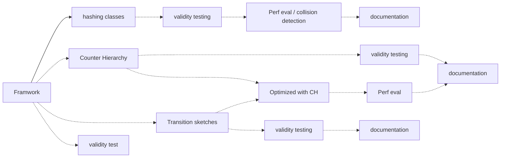

## OmniSketch

Still in developing... Definitely not a stable release.

Read [this doc](http://47.94.237.126/omnisketch/index.html).

### Get the repo

This repo includes submodules. You should clone with
```shell
git clone --recursive https://github.com/N2-Sys/OmniSketch_Adhoc.git
```

### How to swiftly test your new sketch?
1. In `sketch/`, create a file, say `XXX.h`. Remember,
   - Inherit from `SketchBase` and carefully specify template arguments and their order.
   - When written critical method like `update()`, remember to put an `override` specifier at the end of the declaration. For a complete list of such method, see [this page](http://47.94.237.126/omnisketch/class_omni_sketch_1_1_sketch_1_1_sketch_base.html).
   - To quickly pick up, you may mimic `sketch/BloomFilter.h` and `sketch/CMSketch.h`.
2. In `test/`, create another file, say `XXXTest.h`. Remember,
   - Inherit from `TestBase` and keep your template arguments same as for your sketch.
   - To quickly pick up, you may mimic `test/BloomFilterTest.h` and `test/CMSketchTest.h`. For a complete list of methods and members you can use here, see [this page](http://47.94.237.126/omnisketch/class_omni_sketch_1_1_test_1_1_test_base.html).
   - Organize the metric and anything configurable related to the sketch in a config file.
3. Go back to the working space folder, and run `generate_driver.py`. It automatically generates `driver/XXXDriver.cpp`.
   You have to provide the name of the test file name, of the author, path to the default config file and template argument. Use `-h` for helping message. The python script generates driver based on a template C++ program `driver.txt`. See it for yourself.
4. Eventually, add two lines, namely `add_executable([name of the exe] driver/XXXDriver.cpp)` and `target_link_libraries([name of the exe] OmniTools fmt)`, to `CMakeLists.txt`. At this point, go to `build/` and run `cmake ..; make`. If it succeeds, you can now run it from the terminal!
5. Oops! Do NOT forget to add configurations to your config file.

### Roadmap of developing

Here is a diagram demonstrating the roadmap of developing. Arrows stand for dependency. A concrete arrow means done, while a dashed one means yet to do. As you can see, there is a lot of stuff lay in store. Any voluntary work is sincerely appreciated.

- validity testing: Justify the validity of implementations to (hopefully) rule out any bugs. Suggested ways of doing so:
  - Testing on handwoven minimal samples.
  - Cross-check source code.
  
  Codes in framework have undergone thorought testing except for those in namespace `OmniSketch::Test`.